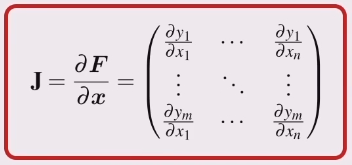

1. Find the expression for x and y (as a function of the joint angles) just like in when finding the inverse kinematics.

2. Make the joint angles functions of time

3. Take the derivative of x and y

4. Factor out the $\dot{q_1}$ and $\dot{q_2}$ so the equation is in matrix form

5. This can be written as $v = \mathbf{J}(q)\dot{q}$

    * $v$ is the tip velocity

    * $\mathbf{J}(q)$ is the Jacobian matrix

### The Jacobian

The Jacobian is the matrix equivalent of the derivative.

Here the Jacobian is a function of the joint angles and the kinematic parameters of the robot.

### Spatial Velocity

Greek letter nu, $nu$

* Used to denote the robot tool velocity (including rotation)
* The end-effector spatial velocity is the product of the manipulator Jacobian matrix and the joint velocity vector.
