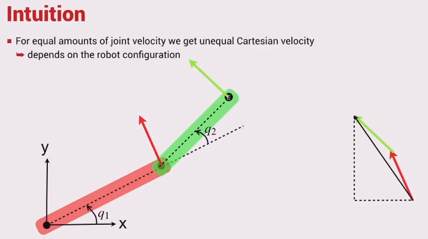

The velocity ellipse describes the ease in which the robot arm may move in either direction.

* The short axis indicates the direction in which the end-effector can move least quickly
* Conversely, the long axis is the direction in which it can move most quickly

A narrow ellipse means the robot is close to a singularity.

It can be described by the equation $$\nu^T (\mathbf{J}(\mathbf{q})\mathbf{J}^T(\mathbf{q}))^{-1} \nu = 1$$
Where $$\nu=(\dot{x},\dot{y})$$ and $$\mathbf{\dot{q}}=(\dot{q_1},\dot{q_2})$$ $$\mathbf{\dot{q}}=\mathbf{J}(\mathbf{q})^{-1}\nu$$

Moving faster in the y direction than x.
