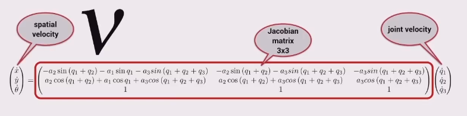
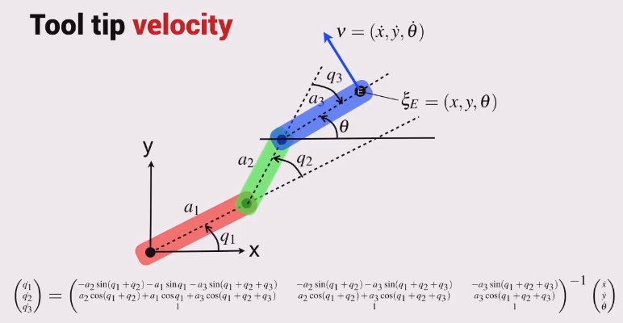

Remember a 3-joint planar arm is able to control its orientation independently of its position.

Find the forward kinematics transform matrix, then

* take the derivative of the translation part and arrange in matrix form,
* then do the same for the rotational part,
* stack them together and you have the 3x3 Jacobian matrix multiplied by the joint velocity vector equals the spatial velocity.

Therefore

Also note

* the number of **rows** of the Jacobian matrix is equal to the dimension of the robot's **task** space,
* and the number of **columns** of the Jacobian matrix is equal to the dimension of the robot's **configuration** space.
