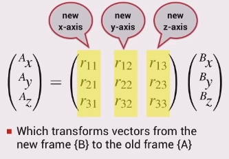
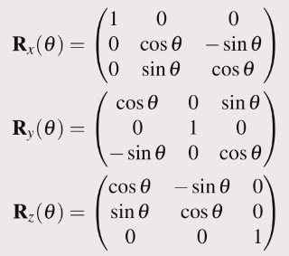

### Rotation in 3D

Frames {A} and {B} share the same origin.

### Properties of the rotation matrix

+ Is an orthogonal (orthonormal) matrix
  - Each column is a unit vector
  - Each column is orthogonal to all other columns
    - the dot product of the two columns is zero
+ The inverse is the same as the transpose $\boldsymbol{R}^{-1} = \boldsymbol{R}^T$
+ The determinant is 1
  - Multiply any vector by the rotation matrix and the length of the
    vector is unchanged
    - so when rotating a vector from one coordinate frame to another, its
      length is not changed

### Elementary rotation matrices

For rotation about either the x, y or z axis.

Multiplying these in various combinations will achieve much more complicated rotations.

