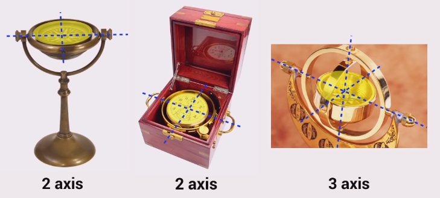

Also known as **Gimbal lock**.

A Gimbal is a mechanism used to stabilise some device to space.

Gimbal lock is when two of the axis become aligned.

For roll-pitch-yaw angles, Gimbal lock occurs when pitch is at $\pi/2$. Results
in rotation axes of the first and third rotations (roll and yaw) parallel.

For example, the set of roll-pitch-yaw angles (30, 90, -20)° is equivalent to
the set (0, 90, 10)°. A pitch of 90° results in Gimbal lock, whereby the roll
and yaw axes become aligned, and thus rotations about these axes can be summed
and by convention assigned to the yaw angle.

To minimise Gimbal lock, choose coordinate conventions so that the pitch angle
is around 0 for normal operating conditions.
