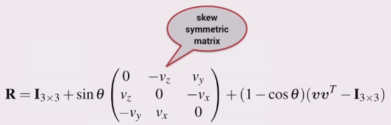

The orientation of a body in 3D can also be described by a single rotation about a particular axis in space.

Need to know the axis of rotation vector $\boldsymbol{v}$, and the angle of
rotation about the vector $\boldsymbol{\theta}$.

### Finding the axis

We observe that the axis around which the rotation occurs must be unchanged by
the rotation, therefore the rotation axis must be an eigenvector of
$\boldsymbol{R}$.

A rotation matrix has three eigenvectors:

+ one real eigenvector corresponding to an eigenvalue of 1
+ two complex eigenvectors with eigenvalues $\lambda = \cos{\theta} \pm
  i \sin{\theta}$ where $\theta$ is the rotation angle

### Finding the rotation matrix

If you know $\theta$ and the eigenvector, then the rotation matrix can be found
using the Rodrigues equation.

