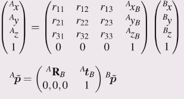

Pose has

+ a **translational** component, and
+ a **rotational** component

It can be represented by

+ vector + Euler angles
+ vector + roll-pitch-yaw angles (fixed angles)
+ vector + Quaternion
+ Homogeneous transformation

Using the rotation matrix avoids singularity's, unlike the Euler and fixed
angle approaches.

