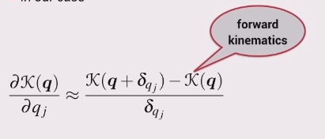

For a 6-link robot, the previous approach to computing the Jacobian becomes unwieldy so a numerical approximation to the forward kinematic function is computed instead.

Just like when you learnt calculus

The derivative is approximated by calculating a finite difference.

1. Find the transformation matrix for some pose
2. Then slightly displace **one** of the joints and then calculate the transformation matrix. A slight displacement may be 0.01 rad $\approx$ 0.5 deg, not too small or hardware might become inaccurate.
3. Then $\frac{\partial T}{\partial q_1} \approx \frac{\mathbf{T(q)} - \mathbf{T(q')}}{displacement_of_joint_1}$
4. From this it is easy to extract out the parts that correspond to the partial derivative of the rotation matrix with respect to joint angle 1, $\frac{\partial\mathbf{R}}{\partial q_1}$, and similarly for the translation portion, $\frac{\partial\mathbf{t}}{\partial q_1}$.

## What About the End-Effector?

### Translation

What to do if you want to find the end-effectors **translational velocity**?

Well this can also be said to be *the rate of change of translation with respect to time*.

This can be found by multiplying the partial derivative of the robots position with respect to $q_1$ and the rate of change of $q_1$ with respect to time.

$$\frac{\partial\mathbf{t}}{\partial q_1} \frac{dq_1}{dt} = \frac{d\mathbf{t}}{dt}$$

The end-effectors translational velocity, $\frac{d\mathbf{t}}{dt}$, can be expressed as $\begin{pmatrix} \dot{x} \\ \dot{y} \\ \dot{z} \end{pmatrix}$ or $\begin{pmatrix} \nu_x \\ \nu_y \\ \nu_z \end{pmatrix}$.

Should end with an expression like

$$\begin{pmatrix} \nu_x \\ \nu_y \\ \nu_z \end{pmatrix} \approx \begin{pmatrix} ? \\ ? \\ ? \end{pmatrix} \dot{q_1}$$

### Rotation

The same can be done for the rotational part with some differences.

Using $\frac{\partial\mathbf{R}}{\partial q_1}$ from step 4,

$$\frac{\partial\mathbf{R}}{\partial q_1} \frac{dq_1}{dt} = \frac{d\mathbf{R}}{dt}$$

Note that $\mathbf{\dot{R}}=\mathbf{S}(\omega)\mathbf{R}$, where $\mathbf{S}(\omega)$ is the skew symmetric matrix.
