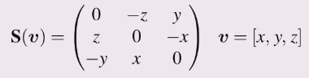

* Also known as an anti symmetric matrix.

$$\mathbf{S}^T=-\mathbf{S}$$
$$\mathbf{S}^T+\mathbf{S}=0$$

* Always singular $$det S = 0$$

* Any matrix is the sum of symmetric and a skew symmetric matrix

* In 3 dimensions 

* An alternative way to express the vector cross product $\mathbf{a} \times \mathbf{b}=\mathbf{S}(\mathbf{a})\mathbf{b}$

## Other Properties

* Zero diagonal
* Exclusion: row x, column y, the element must be a z
* Cyclic rotation (x,y,z,x,y,z,..)
    * sequential -> positive: column x, row y; column z, row x
    * non sequential -> negative: column x, row z; column z, row y
