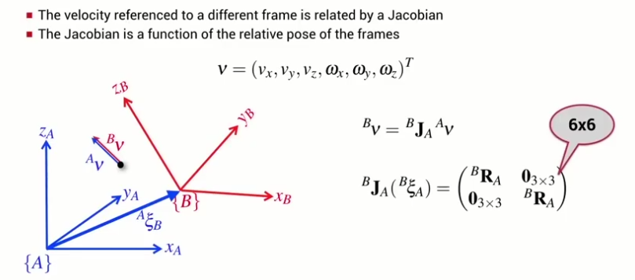

(The-[2D-case](#mapping-2d-spatial-velocity-between-coordinate-frames))

The spatial velocity of a body relative to coordinate frame A is related to its velocity relative to frame B by a Jacobian which is a function of the rotation from frame B to frame A.

We can use the spatial velocity transform to compute an alternative manipulator Jacobian matrix that maps joint velocity to end-effector spatial velocity in the end-effector coordinate frame.
