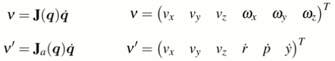
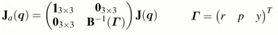
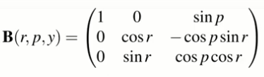

The analytic Jacobian relates change in roll-pitch-yaw angles to angular velocity.

We can re-express the spatial velocity using the analytic Jacobian $\mathbf{J}_a$.

where $\mathbf{J}_a$ is

and

