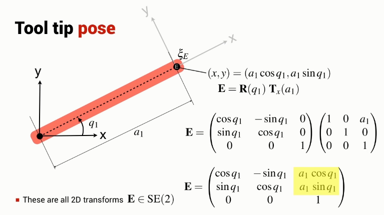

Get to the end effector frame by rotating and translating the reference coordinate frame.

Both position and angle is a function of the angle $q_1$ and so the position and angle cannot be set independently.

i.e. can move to any point lying on a circle

