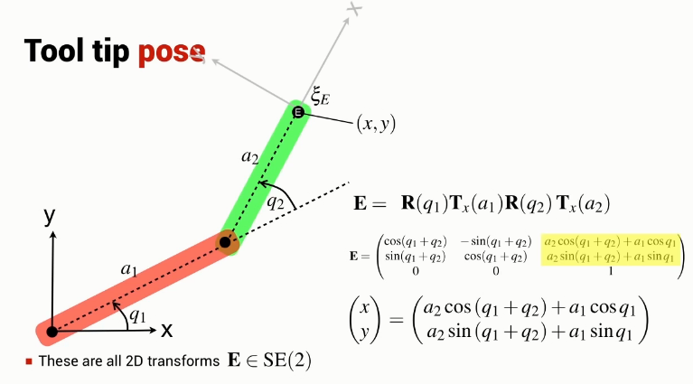

Same as for 1-joint, the orientation of the end effector is not independent from its position in the xy plane.

Always two joint angle configurations that result in the same end effector position.

