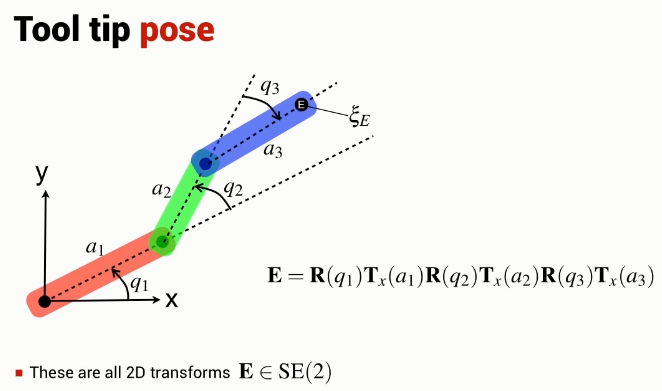

Unlike the 1 and 2 joint planar robotic arm, the orientation and position of the end effector are independent.

There are an infinite number of joint configurations that result in an end-effector position.

