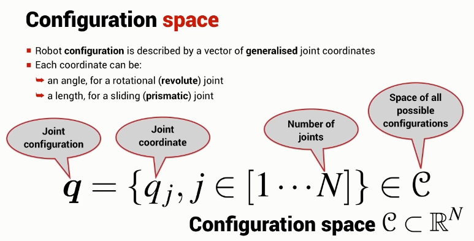

## Configuration Space

q (*joint configuration*) is a vector of length N (*number of joints*) where the elements of q (*joint coordinate*) are either an angle or a length.

q belongs to the space C (*space of all possible configurations*), which is a subset of the N dimensional space.

## Task Space

There is also the space of all possible end-effector poses, T.

## Task and Configuration Space Dimensions

The dimension of the configuration space is the *robots* degrees of freedom, i.e. the number of joints.

The dimension of the task space is the degrees of freedom in the task space.

In the three dimensional world (that we and our robots live), it is not possible to have a task space bigger than six.

**To reach all of the task space** dim C $>=$ dim T

## Redundant Robot

When dim C > dim T (epically when dim C >> dim T), the shape of the arm can be controlled as well as the position/orientation of the end-effector.
