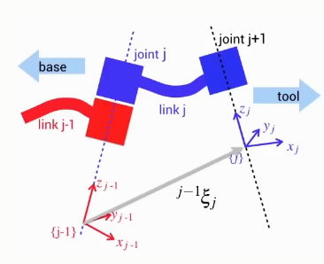
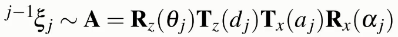

A general theory to describe an articulated sequence of joints.

Each joint in the robot is described by four parameters.

Denavit-Hartenberg notation describes the relationship between 3D coordinate frames attached to two successive links with four parameters.

For a robot with N joints the links are numbered from 0 to N, where link 0 is the fixed base of the robot.

* A coordinate frame is attached to the far (distal) end of every link (closest to the end-effector)

* The pose of a link frame is described with respect to the previous link frame

* Four parameters: $\theta, d, a, \alpha$

## How only 4 parameters when a pose has 6 parameters?

There are constraints when using Denavit-Hartenberg notation:

* Axis $x_j$ intersects axis $z_(j-1)$

* Axis $x_j$ is perpendicular to axis $z_(j-1)$

6 parameters - 2 constraints = 4 parameters

Note that because of these constraints, a link coordinate frame may not necessarily lie on the physical robot.

## The Joint Axis

The axis of each joint is defined by the z-axis of a coordinate frame

* The joint **rotates** about the z-axis (revoltue joint), or

* The joint translates along the z-axis (prismatic joint)

## Parameter Table

A table is used to represent each of the DH parameters for each joint.

A good way to remember how to find each of the parameters is to use the following table.

